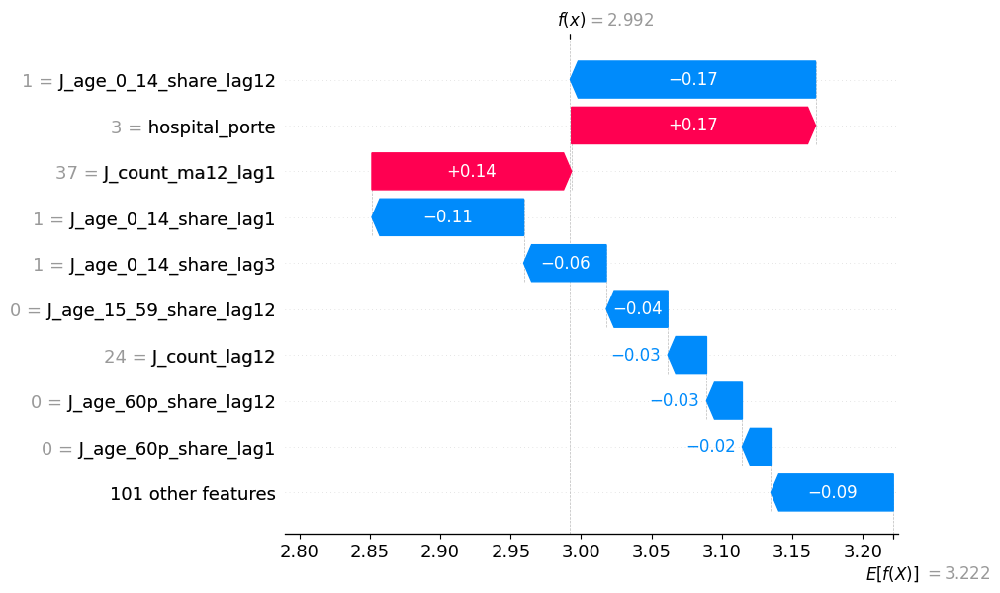
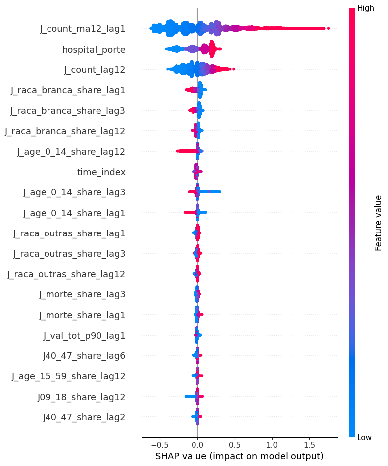
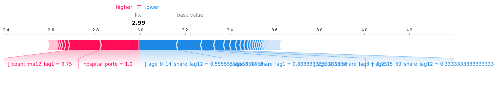
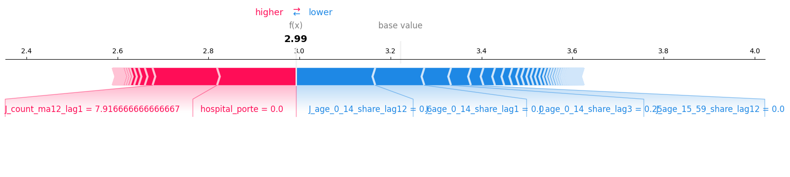
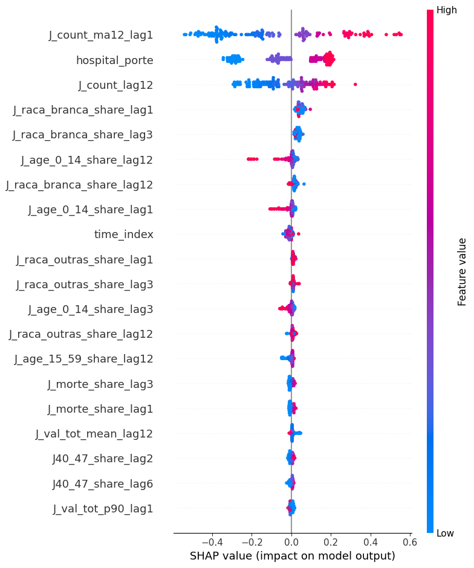
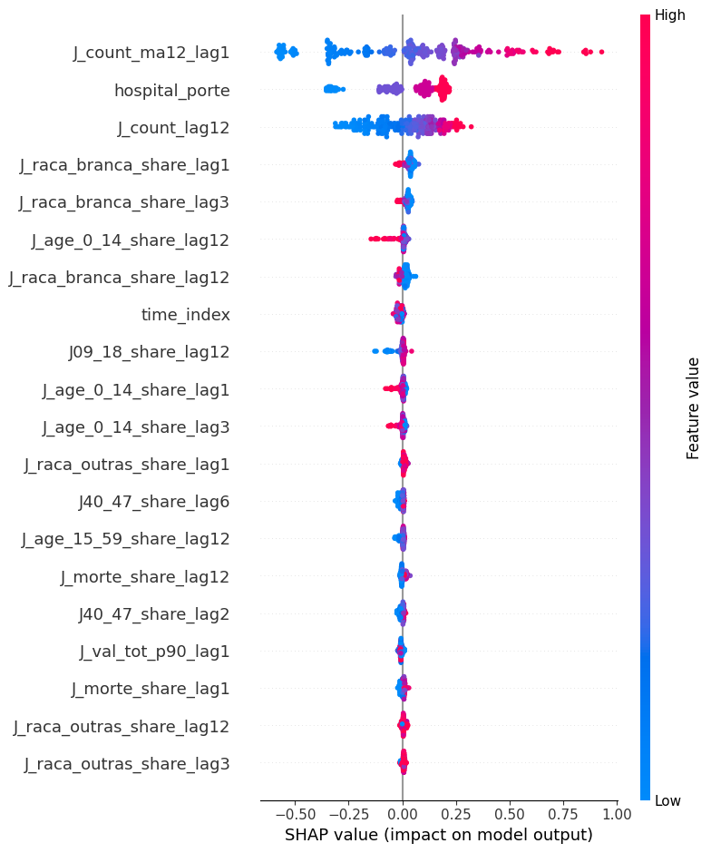
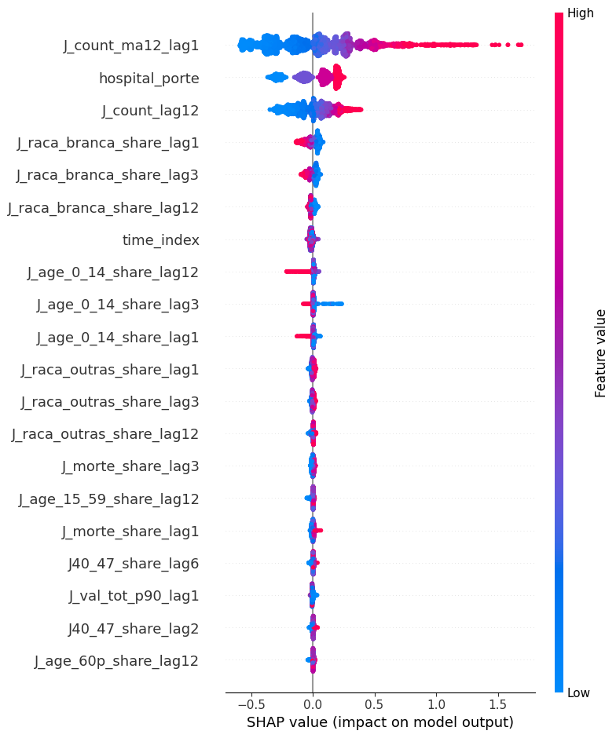

# Relatório de Explicabilidade

## 1: Ferramenta Usada

  Para análise explicativas, decidiu-se usar a ferramenta SHAP. O motivo
é devido à sua acessibilidade, sendo uma ótima ferramenta para desenvolvedores
que nunca trabalharam com explicabilidade de modelos, além de possuir
compatibilidade com LightGBM, o modelo principal usado no projeto atual.

  Devido a performance do modelo LightGBM, foi implementado somente
algoritmos de explicação para ele, ignorando-se completamente o modelo
de regressão linear usado.

  **Obs:** Os gráficos retirados vem do modelo pós avaliação de justiça.

## 2: Resultados Gerais

  Segue-se os resultados obtidos. A explicação de cada um se encontra logo em seguida.

- Esse gráfico apresenta os 9 atributos mais impactantes, e seus respectivos
valores, no modelo.
- Um atributo é muito impactante quando ele altera bastante o valor base em alguma
direção. Em outras palavras, quando o modelo está calculando o valor resultante,
ele começa com um valor base (normalmente, o valor mais provável de ser retornado
pelo modelo) e cada atributo (dependendo do seu valor) soma ou subtrai desse valor
base, até que não haja mais atributos. No fim do processo, as alterações resultam
no valor final retornado pelo modelo.
- Por exemplo, durante o cálculo do valor final, se o atributo "J_age_0_14_share_lag12"
de um dado possui valor 1, subtrai-se 0.17 do valor base.
- No geral, nota-se que os atributos referentes ao grupos de idade alteram
bastante o resultado.

- Esse gráfico apresenta os 20 atributos que mais afetam os resultados
obtidos, apresentando a distribuição dos valores e como eles interferem.
- Essa tabela apresenta a distribuição dos valores (pontos azuis indicam
valores baixos e vermelhos, altos) e como cada afeta o resultado obtido.
Pontos que se distanciam da linha central vertical afetam baseado no lado
onde se encontram (pontos no lado direito aumentam o valor base, e no lado
esquerdo, diminuem). A distância da linha central revela a magnitude da
influência no valor final.
- Por exemplo, para o atributo "J_count_ma12_lag1", valores altos (pontos
vermelhos) alteram o resultado obtido positivamente (lado direito da linha
central, 1.5+), enquanto valores baixos (pontos azuis) alteram negativamente
(lado esquerdo).
- Esse gráfico revela que, além dos atributos sobre idade, atributos sobre
raça também impactam o modelo bastante, assim como o porte do hospital.

## 3: Resultados Locais

- A fim de ilustrar o modelo em funcionamento, alguns gráficos foram
gerados apresentando como um dado é processado, mostrando como cada atributo
altera o valor base.

## 4: Análise regional

- Acompanhando a análise de justiça do modelo, foi feito uma análise por região,
verificando como os atributos se comportavam dado uma região.
- Devido à quantidade de resultados, será apresentado apenas 3 gráficos
(AC, AL, MG, respectivamente) obtidos, que serviram de exemplificação das
conclusões obtidas.

- Notou-se que as regiões apresentavam comportamento igual quanto aos atributos
que mais impactam ("J_count_ma12_lag1", "hospital_porte" e "J_count_lag12"),
assim como quais direções esses atributos impactam. No entanto, há uma diferença
quanto à escala (observe os valores no eixo x).

## 5: Conclusão

- A partir das observações retiradas, nota-se que para o modelo, as informações
mais importantes são o tipo do hospital, a quantidade de pessoas de diferentes
faixas etárias, sua média mensal no últimos 12 meses e quantas internações ele
teve no mesmo mês no ano passado. Outras informações que também impactam são a
quantidade de pessoas de diferentes sexos e etnias.
- Notou-se também que, diferentemente da análise de justiça, a diferença entre as
regiões é pequena, apresentando um comportamento similar sobre os atributos.
