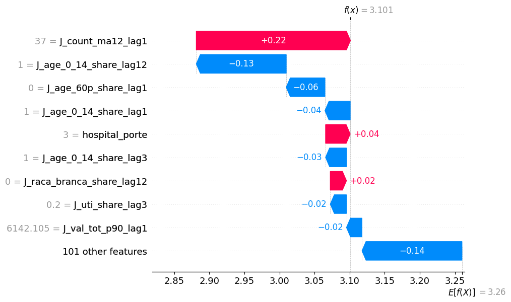
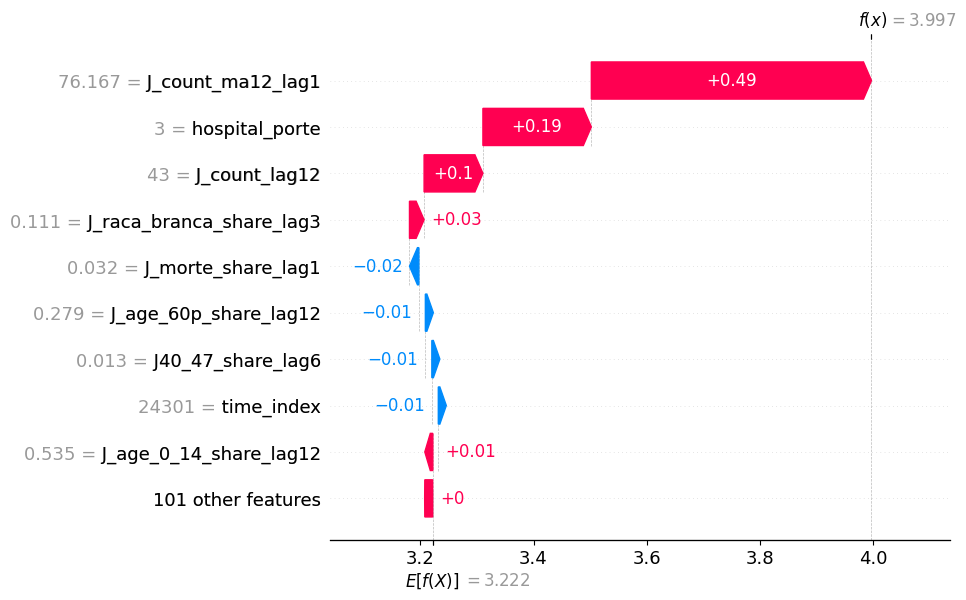
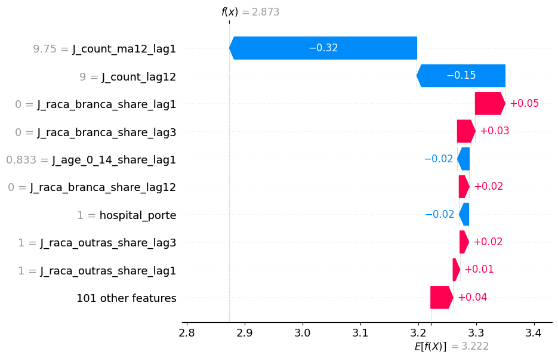
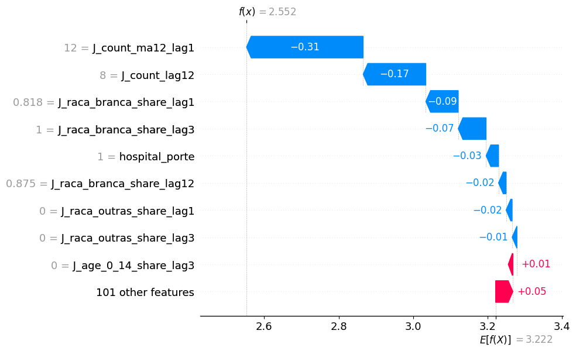

# Relatório de Explicabilidade

## 1: Ferramenta Usada

  Para análise explicativas, decidiu-se usar a ferramenta SHAP. O motivo
é devido à sua acessibilidade, sendo uma ótima ferramenta para desenvolvedores
que nunca trabalharam com explicabilidade de modelos, além de possuir
compatibilidade com LightGBM, o modelo principal usado no projeto atual.

  Devido a performance do modelo LightGBM, foi implementado somente
algoritmos de explicação para ele, ignorando-se completamente o modelo
de regressão linear usado.

  **Obs:** Os gráficos retirados vem do modelo pós avaliação de justiça.

## 2: Resultados Locais

  Segue-se os resultados obtidos. A explicação se encontra logo em seguida.

- Esse gráfico apresenta os 9 atributos mais impactantes, e seus respectivos
valores, para um dado específico (nesse caso, o primeiro dado do dataset de
teste).
- Um atributo é muito impactante quando ele altera bastante o valor base em alguma
direção. Em outras palavras, começando de um valor base (normalmente, o valor mais
provável de ser retornado pelo modelo), cada atributo (dependendo do seu valor)
soma ou subtrai desse valor base, até que não haja mais atributos. Ao final,
esse grafo apresenta os atributos que mais impactaram o resultado, junto de seus
valores e por quanto eles afetaram.
- Por exemplo, para esse dado, o atributo "J_age_0_14_share_lag12" -
cujo valor é 1 - subtrai 0.13 do valor base, enquanto "J_count_ma12_lag1" -
com valor 37 - aumenta o valor base em 0.22.
- Para esse caso, notou-se que os atributos referentes ao grupos de idade alteraram
bastante o resultado, além da média dos 12 meses passados, a qual foi a mais impactante.

- Observando o comportamento dos atributos em outros dados, nota-se que
os atributos afetam muito o resultado dependendo de seu valor. Por exemplo,
a média de internações dos 12 meses passados afeta positivamente o resultando
quando ela é alta (> 30) e afeta negativamente quando ela é baixa (< 20).
Esse comportamento dos atributos será explorado melhor na próxima seção.
- Nota-se que "J_count_ma12_lag1" é o atributo mais comum e mais impactante nos
gráficos. Isso indica que o modelo depende bastante desse dado para retornar
suas previsões. Porém nota-se também que atributos relacionados à raça podem
impactar os resultados dependendo de seu valor.

## 3: Resultados Globais

- Esse gráfico apresenta os 20 atributos que mais afetam os resultados
obtidos, apresentando a distribuição dos valores e como eles interferem.
- Essa tabela apresenta a distribuição dos valores (pontos azuis indicam
valores baixos e vermelhos, altos) e como cada afeta o resultado obtido.
Pontos que se distanciam da linha central vertical afetam baseado no lado
onde se encontram (pontos no lado direito aumentam o valor base, e no lado
esquerdo, diminuem). A distância da linha central revela a magnitude da
influência no valor final.
- Por exemplo, para o atributo "J_count_ma12_lag1", valores altos (pontos
vermelhos) alteram o resultado obtido positivamente (lado direito da linha
central, 1.5+), enquanto valores baixos (pontos azuis) alteram negativamente
(lado esquerdo -0.7).
- Esse gráfico revela que, além dos atributos sobre idade, atributos sobre
raça também impactam o modelo bastante, assim como o porte do hospital.

## 4: Análise regional

- Acompanhando a análise de justiça do modelo, foi feito uma análise por região,
verificando como os atributos se comportavam dado uma região.
- Devido à quantidade de resultados, será apresentado apenas 3 gráficos
(AC, AL, MG, respectivamente) obtidos, que serviram de exemplificação das
conclusões obtidas.

- Notou-se que as regiões apresentavam comportamento igual quanto aos atributos
que mais impactam ("J_count_ma12_lag1", "hospital_porte" e "J_count_lag12"),
assim como quais direções esses atributos impactam. No entanto, há uma diferença
quanto à escala (observe os valores no eixo x).

## 5: Conclusão

- A partir das observações retiradas, nota-se que para o modelo, as informações
mais importantes são o tipo do hospital, a quantidade de pessoas de diferentes
faixas etárias, sua média mensal no últimos 12 meses e quantas internações ele
teve no mesmo mês no ano passado. Outras informações que também impactam são a
quantidade de pessoas de diferentes sexos e etnias.
- Notou-se também que, diferentemente da análise de justiça, a diferença entre as
regiões é pequena, apresentando um comportamento similar sobre os atributos.
